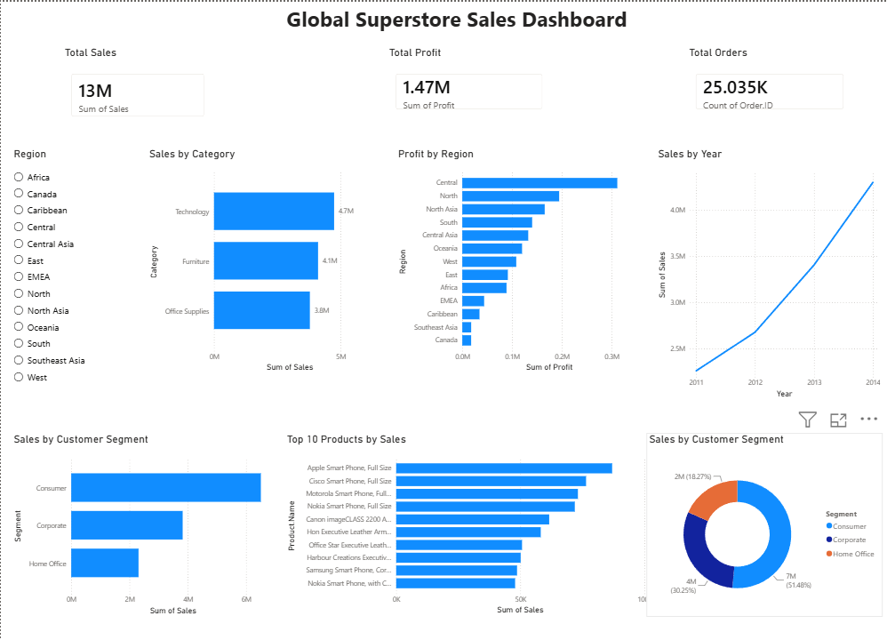

# 📊 Global Superstore Sales Dashboard

## 📌 Project Overview

This project presents an interactive Power BI dashboard built using the Global Superstore dataset. The dashboard provides insights into sales performance, profit, customer segments, regions, and top-performing products.

---

## 🚀 Dashboard Highlights

- 💰 Total Sales
- 📈 Total Profit
- 📦 Total Orders
- 📊 Sales by Category
- 🌍 Profit by Region
- 📅 Sales Trend by Year
- 👥 Sales by Customer Segment
- 🏆 Top 10 Products by Sales
- 🎯 Region Filter (Slicer)

---

## 🛠️ Tools Used

- Microsoft Power BI
- Global Superstore Dataset

---

## 📷 Dashboard Preview

---

## 📂 Files Included

- Global Superstore Sales Dashboard.pbix
- dashboard.png
- superstore.csv

---

## 📈 Key Insights

- Technology generated the highest sales.
- Central region recorded the highest profit.
- Sales increased consistently from 2011 to 2014.
- Consumer segment contributed the highest sales.
- Apple and Motorola products were among the top-selling products.

---

## 👨‍💻 Author

**Rithesh Salian**
